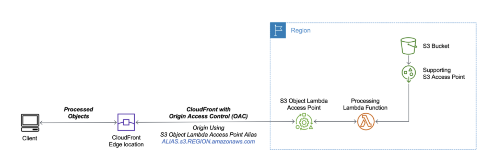

# Image Resizing Terraform Module

- [Image Resizing Terraform Module](#image-resizing-terraform-module)
  - [Solution Architecture](#solution-architecture)
  - [Installation](#installation)
  - [Usage](#usage)
    - [Distribution query attributes](#distribution-query-attributes)
    - [Lambda function spec](#lambda-function-spec)
  - [References](#references)

## Solution Architecture

## Installation

## Usage

### Distribution query attributes
| Headers   | Description | Valid Values            | Type    |
| --------- | ----------- | ----------------------- | ------- |
| transform | Title       | fit, crop               | string  |
| original  | Text        | true, false             | boolean |
| width     | Text        | 100,200                 | int     |
| quality   | Text        | low, medium, high, best | string  |
| height    | Text        | 100, 200                | int     |

### Lambda function spec

## References
- https://aws.amazon.com/blogs/aws/new-use-amazon-s3-object-lambda-with-amazon-cloudfront-to-tailor-content-for-end-users/
- https://docs.aws.amazon.com/AmazonS3/latest/userguide/transforming-objects.html
