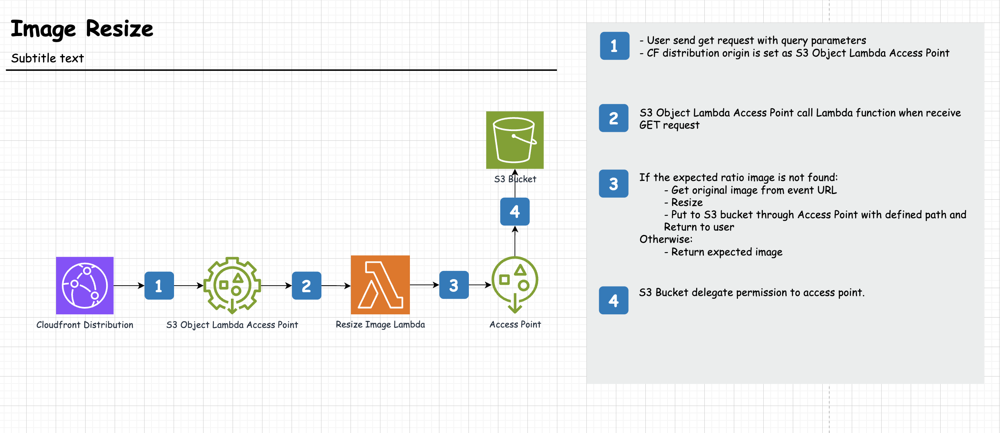

# Image Resizing Terraform Module

- [Image Resizing Terraform Module](#image-resizing-terraform-module)
  - [Solution Architecture](#solution-architecture)
  - [Installation](#installation)
    - [Requirements providers](#requirements-providers)
    - [Install with new bucket](#install-with-new-bucket)
    - [Install with existing bucket](#install-with-existing-bucket)
  - [Usage](#usage)
    - [Distribution query parameters](#distribution-query-parameters)
    - [Lambda function spec](#lambda-function-spec)
    - [How to test](#how-to-test)
  - [References](#references)

## Solution Architecture



## Installation
### Requirements providers

| Name                                              | Version          |
| ------------------------------------------------- | ---------------- |
| <a name="provider_aws"></a> [aws](#provider\_aws) | >= 5.31.0, < 6.0 |


### Install with a new bucket
1. Install AWS SAM CLI

- [Install SAM CLI instructions](https://docs.aws.amazon.com/serverless-application-model/latest/developerguide/install-sam-cli.html#install-sam-cli-instructions)

2. Build source code
    ```
      make build
    ```
3. Provision Instructions: Copy and paste into your Terraform configuration, insert the variables, and run `terraform init`.
    ```
    module "image_resize" {
      source = "git::https://github.com/ahiho/terraform-aws-image-resize.git?ref=v1.0.0"
      --- variables ---
    }
    ```
### Install with an existing bucket
1. Set `create_new_bucket=false`
2. Make sure that your s3 bucket delegates all needed permissions to the s3 access point created by this stack. Example: `
    ```
      statement {
      sid    = "AccessPoint"
      effect = "Allow"
      principals {
        type        = "AWS"
        identifiers = ["*"]
      }
      actions = ["*"]
      resources = [<your s3 bucket ARN>]
      condition {
        test     = "StringEquals"
        variable = "s3:DataAccessPointAccount"
        values   = [<your account id>]
      }
    }
    ```
## Usage

### Distribution query parameters

| Headers   | Description               | Valid Values            | Type    | Default |
| --------- | ------------------------- | ----------------------- | ------- | ------- |
| transform | image transformation mode | fit, crop               | string  | crop    |
| width     | specifies image width     | 100..4100               | int     | 640     |
| quality   | specifies image quality   | low, medium, high, best | string  | high    |
| height    | specifies image height    | 100..4100               | int     | 400     |
| original  | get the original image    | true, false             | boolean | false   |
| blur      | specifies image blur      | 0..50                   | boolean | 0       |

### Lambda function spec

The Lambda function using these environments

- **IMAGE_BUCKET_REGION** _(required)_: The region where the image bucket is located.
- **IMAGE_BUCKET_NAME** _(required)_: The name of the image bucket.
- **ROUNDING_VALUE**: The rounding value to be used during image resizing.
- **LOG_LEVEL**: The log level of the Lambda function. Valid values are `DEBUG`.

The Lambda function follows a structured workflow to process image resizing:

1. Extracts the S3 URL from the event object.
2. Retrieves the original image from the S3 URL.
3. Checks if a resized image already exists. If it does, the returns the resized image; otherwise, it proceeds to the next step.
4. Applies the requested image transformation (e.g., fit, crop) based on the provided query parameters.
5. Puts the resized image to S3 bucket.
6. Returns the resized image.

### How to test
1. Get distribution URL from AWS console. Example `https://xxxxxxxxxxxxxx.cloudfront.net`
2. Put image to S3 bucket. Example `test.png`
3. Combine distribution URL and image key together. Example `https://xxxxxxxxxxxxxx.cloudfront.net/test.png`

## References

- https://aws.amazon.com/blogs/aws/new-use-amazon-s3-object-lambda-with-amazon-cloudfront-to-tailor-content-for-end-users/
- https://docs.aws.amazon.com/AmazonS3/latest/userguide/transforming-objects.html
